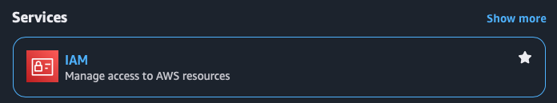

# AWS - Setup

You need to have an AWS account to follow this training. There is an AWS account specifically for graduate training.

## AWS CLI

While the bulk of this training will be done through the AWS console in a web browser, you will need the CLI in order to push your Docker images to ECR. To install the AWS CLI, open the company portal and search for `AWS Command Line Interface v2` and install it.

## AWS Console

You will need to request access to the AWS console. Go to [my access](myaccess.microsoft.com) and request access to the AWS Grad Training account. For business justification just put something like "required for graduate training".

Once you have access, you will be able to log in by selecting the Amazon Web Services app on [my apps](myapps.microsoft.com). If you do not see the app you may have to wait until your access privileges are updated. This may take some time so it's a good idea to request access as soon as possible.

From the AWS access portal, you should be able to see the Grad Training account. Click the little white triangle and you should see two links: `AdministratorAccess` and `Access keys`. Clicking on Access keys will allow you to create a temporary access key. These can be useful but they expire after about an hour. Clicking on `Administrator Access` will take you to the AWS Console.

### Creating an IAM account

IAM stands for Identity and Access Management. This is the service that manages permissions and access within AWS. For this training you will need to create an IAM user. While you already have access to the console, and IAM user is how you will gain CLI access (among other things).

- Click on `AdministratorAccess` to open the Console. You should be presented with a dashbaord UI.
- In the search bar at the top search for `IAM` and select it from the services section.

  

- From the left sidebar under `Access management`, click on `Users`.
- Click the `Create user` button,
- For the username, enter your Scott Logic id, followed by `_cli`.
  - So for example, if your name is John Smith and your SL ID is `jsmith`, your username would be `jsmith_cli`.
  - Press next.
- Add your new user to the `grad admin` group.
- Click create.

### Creating Access Tokens

- Click on your new user account and select the `Security credentials` tab.
- Scroll down to the access keys section and click the button to create an access key.
- Under use case, pick `Command Line Interface (CLI)`.
  - Confirm that you understand the recommendation
  - Click next
- Add a description if you want and click create
- IMPORTANT: this is the only time you can see your access key. If you forget it you will have to create a new one. Download the CSV file and then click done.

### Configuring the AWS CLI

Open a new terminal. You can verify that you have the AWS CLI correctly installed by running `aws --version`.

- Run `aws configure`
- Open the CSV file you downloaded earlier, copy the `Access Key` value, paste it into the terminal, and press enter.
- Copy the secret access key in the same way.
- For default region name type `eu-west-2` and press enter.
- For default output format type `json` and press enter.

You should now have the AWS CLI set up with your IAM account ready for the next stage of the training!
